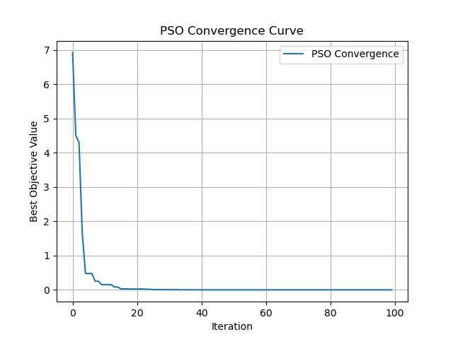

# Particle Swarm Optimization (PSO)


A clean, lightweight Python implementation of the Particle Swarm Optimization (PSO) algorithm to find the global minimum of mathematical functions. This project is built from scratch using only **NumPy** for numerical operations and **Matplotlib** for visualization.

## 🎯 About the Project

Particle Swarm Optimization (PSO) is a computational method inspired by the social behavior of bird flocking or fish schooling. It's a metaheuristic algorithm, meaning it can find a good-enough solution to a complex problem in a reasonable amount of time, especially for problems where a precise, traditional method is too slow or impossible.

This repository provides a simple, well-commented implementation of PSO. It's set up to solve the **Sphere function**, a common benchmark for optimization algorithms, but can be easily adapted to any mathematical function.

### Features
* **From Scratch:** Implemented in pure Python.
* **Vectorized:** Uses **NumPy** for efficient, high-performance calculations.
* **Visualized:** Includes code to plot the convergence curve using **Matplotlib**, showing how the algorithm's best solution improves over iterations.
* **Customizable:** Key parameters (swarm size, iterations, cognitive/social weights) are easy to modify.

## 🛠️ Prerequisites

To run this project, you will need:
* Python 3.7+
* NumPy
* Matplotlib

## ⚙️ Installation & Usage

1.  **Clone the repository:**
    ```bash
    git clone [https://github.com/YourUsername/pso-from-scratch.git](https://github.com/YourUsername/pso-from-scratch.git)
    cd pso-from-scratch
    ```

2.  **Install the required libraries:**
    ```bash
    pip install numpy matplotlib
    ```

3.  **Run the script:**
    (Assuming you named the file `pso.py`)
    ```bash
    python pso.py
    ```

## 📊 Example Output

Running the script will print the final best solution found by the algorithm and display a convergence plot.

### Text Output

The algorithm will find the best position (the input `x` vector) and the best value (the function's output). Since the optimal solution for the Sphere function is `0.0` at position `[0, 0, ...]`, you will see results very close to this:

```
Best Position: [ 1.4529e-12 -9.8874e-13  4.6210e-13 -1.2055e-12  8.3245e-14]
Best Value: 4.1922e-24
```
*(Note: Your exact values will vary due to the random initialization.)*

### PSO Convergence Curve

The script will also display a plot showing how the "Best Objective Value" (the global best) decreases with each iteration. This visualizes the swarm "converging" on the optimal solution.



*(This is an example plot. You will need to save your own `pso_convergence_curve.png` from the script's output and add it to your repo.)*

## 🧠 How It Works

The algorithm's core logic is based on two simple equations that are applied to each particle in the swarm at every iteration.

1.  **Velocity Update:** Each particle's velocity is updated based on three components:
    * Its own inertia (previous velocity).
    * Its "cognitive" pull (toward its own personal best position, `pbest`).
    * The "social" pull (toward the swarm's global best position, `gbest`).

    $$v_i(t+1) = w \cdot v_i(t) + c_1 \cdot r_1 \cdot (pbest_i - x_i(t)) + c_2 \cdot r_2 \cdot (gbest - x_i(t))$$

2.  **Position Update:** The particle's new position is calculated by adding its new velocity to its old position.

    $$x_i(t+1) = x_i(t) + v_i(t+1)$$

The process is repeated for a set number of iterations, allowing the swarm to explore the search space and gradually converge on the global minimum.

## 🔧 Customization

You can easily adapt this project by:

1.  **Changing the Objective Function:**
    Replace the `objective()` function with any function you want to minimize.

    ```python
    # Example: Rastrigin function
    def objective(x):
        return 10 * len(x) + np.sum(x**2 - 10 * np.cos(2 * np.pi * x))
    ```

2.  **Tuning the PSO Parameters:**
    Adjust the parameters in the main execution block:

    ```python
    dim = 5              # Number of dimensions for the problem
    bounds = (-10, 10)   # Search space boundaries (min, max)
    num_particles = 30   # Size of the swarm
    max_iter = 100       # Number of iterations
    w = 0.7              # Inertia weight
    c1 = 1.5             # Cognitive (personal) coefficient
    c2 = 1.5             # Social (global) coefficient

    best_pos, best_val, convergence = PSO(objective, dim, bounds, num_particles, max_iter, w, c1, c2)
    ```

